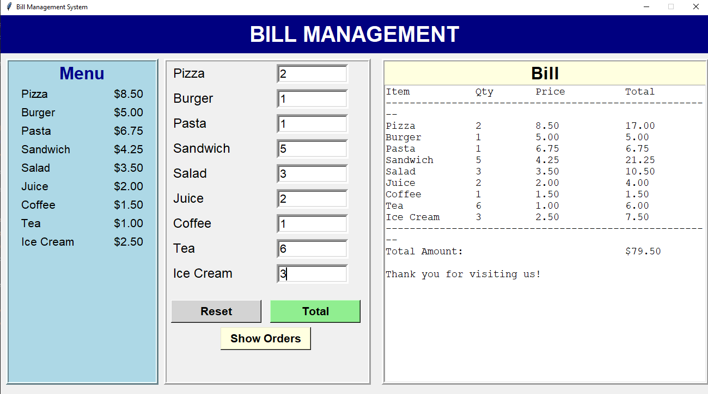
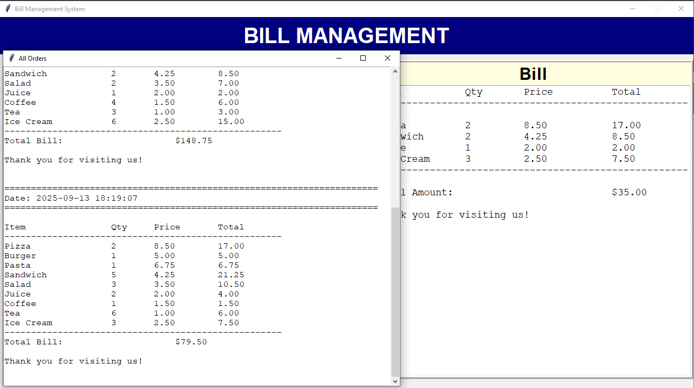

# Bill Management System

**bill management system** built with Python, Tkinter, and SQLite.It provides a GUI for creating bills from a fixed food menu, saving order details to a database, and reviewing past bills.

---

## **Features**
- **Menu Display** – View available items with their prices.
- **Order Management** – Enter item quantities and generate bills.
- **Total Calculation** – Automatically calculates the total bill.
- **Database Integration** – Stores order history using SQLite.
- **Order History** – Retrieve and display previous orders.
- **Error Handling** – Prevents negative or invalid inputs.

---

##  Tech Stack
- **Language**: Python 3.x
- **GUI**: Tkinter
- **Database**: SQLite3

---

## Project Structure
- database.py     --->  Database layer (SQLite + order history viewer)
- gui.py          --->  Tkinter-based GUI application
- main.py         --->  Entry point for running the app
- bills.db        --->  Auto-generated SQLite database (created at runtime)

---


## How to Run

### Prerequisites
Ensure you have **Python 3.13** installed on your system.

### Steps

1. Clone this repository:
   ```bash
   git clone https://github.com/ahmed-elbehidy/bill-management-system
1. Navigate to the project folder:
   ```bash
   cd bill-management-system
1. Run the application:
   ```bash
   python src/main.py

---

## Screenshots



